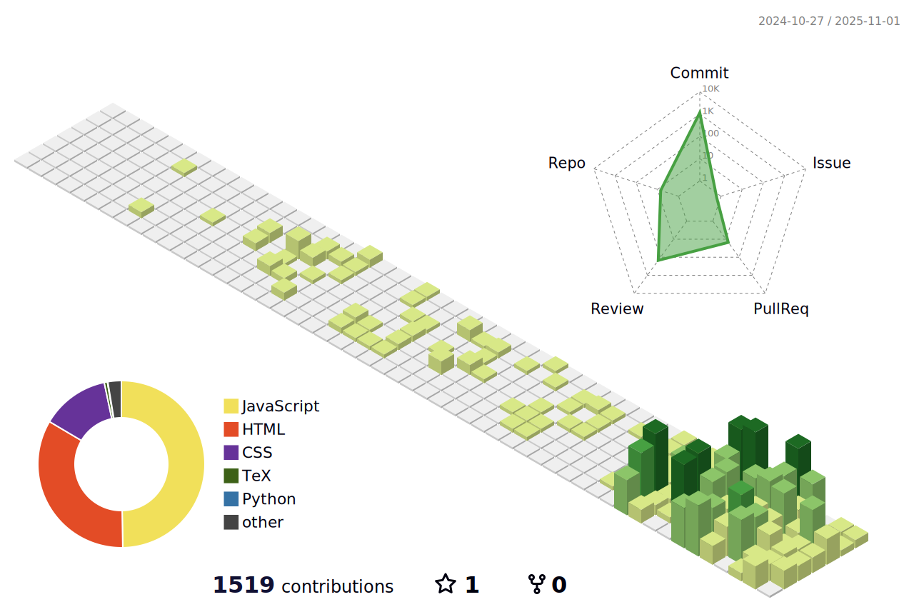

🔬 **Scholarly Works**  

  

  

  
<!---  -->

🔨 **Languages and Tools**  

 

 

 

 

 

<!--

--->

<!---
| CONTENT   | RESOURCES     | 
|----------|----------|
| Data    | [RedCap](https://project-redcap.org/) [EMBL-EBI](https://www.ebi.ac.uk/submission/) [NCBI](https://submit.ncbi.nlm.nih.gov/subs/) [BioProject](https://submit.ncbi.nlm.nih.gov/about/bioproject-biosample/) [SRA](https://submit.ncbi.nlm.nih.gov/subs/sra/) [Genome](https://submit.ncbi.nlm.nih.gov/subs/genome/) [PubChem](https://pubchem.ncbi.nlm.nih.gov/submit/) | 
Data Coalitions | [Global BioData](https://globalbiodata.org/what-we-do/global-core-biodata-resources/list-of-current-global-core-biodata-resources/) [OpenData](https://registry.opendata.aws/) [Elixir](https://elixir-europe.org/) [OmicsDI](https://www.omicsdi.org/database) [DDBJ](https://www.ddbj.nig.ac.jp/index-e.html) [EMBL-EBI](https://www.ebi.ac.uk/) [NCBI](https://ncbi.nlm.nih.gov/) [SIB](https://www.expasy.org/) | 
High-Performance Computing | [NeuroSnap AI](https://neurosnap.ai/) [NIH HPC](https://hpc.nih.gov/) [NSF Access](https://allocations.access-ci.org/get-your-first-project) [TACC](https://tacc.utexas.edu/) |
Artificial Intelligence | [Goodfellow 2016 _Deep Learning_](https://www.deeplearningbook.org/) | 
| Small Molecules Drugs | [Isomorphic Labs](https://www.isomorphiclabs.com/) [ChEBI](https://www.ebi.ac.uk/chebi/) [ChEMBL](https://www.ebi.ac.uk/chembl/) [BindingDB](https://www.bindingdb.org/rwd/bind/index.jsp) [DrugBank](https://www.drugbank.com/) [SwissDrug](https://www.molecular-modelling.ch/swiss-drug-design.html) [OrphData](https://www.orphadata.com/) [IUPHAR](https://www.guidetopharmacology.org/) [PharmGKB](https://www.pharmgkb.org/) [ChemAxon](https://chemaxon.com/) | 
| Life Science Vendors | [Thermo](https://www.thermofisher.com/us/en/home.html) [Eppendorf](https://www.eppendorf.com/us-en/) [Qiagen](https://digitalinsights.qiagen.com/products-overview/discovery-insights-portfolio/enterprise-ngs-solutions/qiagen-clc-genomics-cloud/) [Schrodinger](https://www.schrodinger.com/platform/products/virtual-cluster/) [Emerald Cloud Labs](https://www.emeraldcloudlab.com/)
| Infectious Diseases |  [BacDive](https://bacdive.dsmz.de/) [BEI](https://www.beiresources.org/) [CDC AR Isolate Bank](https://wwwn.cdc.gov/arisolatebank/) [BV-BRC](https://www.bv-brc.org/) [MGnify](https://www.ebi.ac.uk/metagenomics) [CARD](https://card.mcmaster.ca/) [Silva](https://www.arb-silva.de/) [EcoCyc](https://ecocyc.org/) [SubtiWiki](https://www.subtiwiki.uni-goettingen.de/v5/welcome) [FungiDB](https://fungidb.org/) [LPSN](https://lpsn.dsmz.de/)[ViralZone](https://viralzone.expasy.org/) [ViralHostRangeDB](https://viralhostrangedb.pasteur.cloud/) [VirusHostDB(JP)](https://www.genome.jp/virushostdb/) [Viruses(NCBI)](https://www.ncbi.nlm.nih.gov/labs/virus/) [HIVDB](https://hivdb.stanford.edu/) |
| Proteins and Enzymes | [AlphaFold](https://alphafoldserver.com/) [UniProt](https://www.uniprot.org/) [UniProt3D](https://uniprot3d.org/) [EMPIAR](https://www.ebi.ac.uk/empiar/) [EMDB](https://www.ebi.ac.uk/emdb/) [EMDataResource](https://www.emdataresource.org/) [CryoSPARC](https://cryosparc.com/) [Cryo-ET](https://cryoetdataportal.czscience.com/) [WW-PDB](https://www.wwpdb.org/)  [RCSB-PDB](https://www.rcsb.org/) [InterPro](https://www.ebi.ac.uk/interpro/) [UCSF ChimeraX](https://www.cgl.ucsf.edu/chimerax/) [OpenStructure](https://openstructure.org/) [CATH](http://www.cathdb.info/) [SBGrid](https://sbgrid.org/) [OPIG](https://opig.stats.ox.ac.uk/) [OpenTargets](https://www.opentargets.org/publications) [TCBG](https://www.ks.uiuc.edu/) | 
| Interactions & Reactions | [Reactome](https://reactome.org/) [RHEA](https://www.rhea-db.org/) [STRING](https://string-db.org/) [BRENDA](https://www.brenda-enzymes.org/) [IMEx](https://www.imexconsortium.org/) | 
| Expression |  [BioImage](https://www.ebi.ac.uk/bioimage-archive/submit/) [Expression (JAX)](https://www.informatics.jax.org/expression.shtml/) [GTEx](https://www.gtexportal.org/home/) [GXA](https://www.ebi.ac.uk/gxa/home) [GEO](https://www.ncbi.nlm.nih.gov/geo/) [ProteomeXchange](https://www.proteomexchange.org/) [Human Protein Atlas](https://www.proteinatlas.org/) [RTI](https://www.umassmed.edu/rti/oncampus/rna-tools/) [archs4](https://archs4.org/)
| Genomes & Models | [YeastGenome](https://yeastgenome.org/) [WormBase](https://wormbase.org/) [FlyBase](https://flybase.org/) [ZFin](https://zfin.org/) [GenCodes](https://www.gencodegenes.org/) [RatGenomeData](https://rgd.mcw.edu/) [Ensembl](https://useast.ensembl.org/index.html) [ClinGen](https://www.clinicalgenome.org/) |
| Other | [GO](https://geneontology.org/) [KEGG](https://www.genome.jp/kegg/kegg1.html) [MDDDB](https://mddbr.eu/) [BioModels](https://www.ebi.ac.uk/biomodels/) [LipidMaps](https://www.lipidmaps.org/) | 
| Health |  [USPSTF](https://www.uspreventiveservicestaskforce.org/webview/#/) [HealthCheckTools](https://medlineplus.gov/healthchecktools.html) [MyHealthFinder](https://odphp.health.gov/myhealthfinder) |
| Clinical Research | [ResearchMatch](https://www.researchmatch.org/) [HHS.Gov Open-Data](https://cdo.hhs.gov/s/open-data) [AllOfUs](https://allofus.nih.gov/) [UK BioBank](https://www.ukbiobank.ac.uk/) [BioBank Japan](https://biobankjp.org/en/) |
| Academia |  [AI Patient](https://geiselmed.dartmouth.edu/thesen/patient-actor-app/) [OpenEvidence](https://www.openevidence.com/) [OpenRead](https://www.openread.academy/) [Copyright.com](https://www.copyright.com/) |
